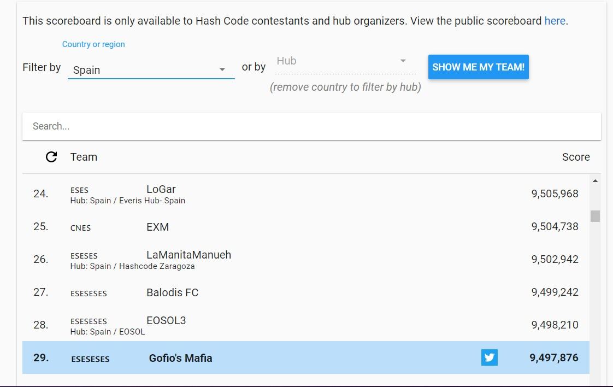
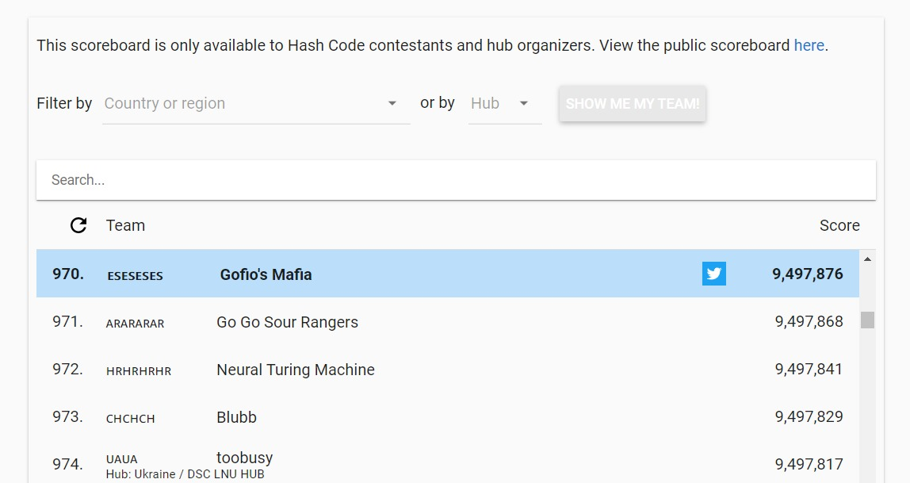

<h1 align="center">Hash Code 2021</h1>
<h4 align="center">Online qualification round of #HashCode2021, a Google programming competition to solve a team-based challenge</h4>

## Problem statement

The world's first traffic light dates back to 1868. It was installed in London to control traffic for… horse-drawn vehicles! Today, traffic lights can be found at street intersections in almost every city in the world, making it safer for vehicles to go through them.

Traffic lights have at least two states- and use one color (usually red) to signal "stop"- and another (usually green) to signal that cars can proceed through. The very first traffic lights were manually controlled. Nowadays they are automatic, meaning that they have to be carefully designed and timed in order to optimize the overall travel time for all the participants in traffic.

## Task
Given the description of a city plan and planned paths for all cars in that city, you will be optimizing the schedule of traffic lights to minimize the total amount of time spent in traffic, and help as many cars as possible reach their destination before a given deadline.

More details on [docs/problem.pdf](docs/problem.pdf).

## Solution
The [implemented solution](src/main.py) consisted in estimating a demand for each street, based on the number of cars that will pass through that street. To generate the intersections,
for each one, we normalize all the demands of the streets that have that intersection at the end, and we give to each street a proportional time to their normalized demand. 
It was also tried taking into account the street duration (also normalized) but the results were not as good as just analyzing the demand.

## Scoreboard
Our solution achieved the 29th in the Spanish Scoreboard and 970 globally.

## Certificate
*PENDING*

## Team
- Angel Igareta - [LinkedIn](https://www.linkedin.com/in/angeligareta/)
- Cristian Abrante - [LinkedIn](https://www.linkedin.com/in/cristianabrante/)
- Carlos Domínguez - [LinkedIn](https://www.linkedin.com/in/carlos-dominguez-garcia/)
- Daute Rodríguez - [LinkedIn](https://www.linkedin.com/in/dauterr/)
